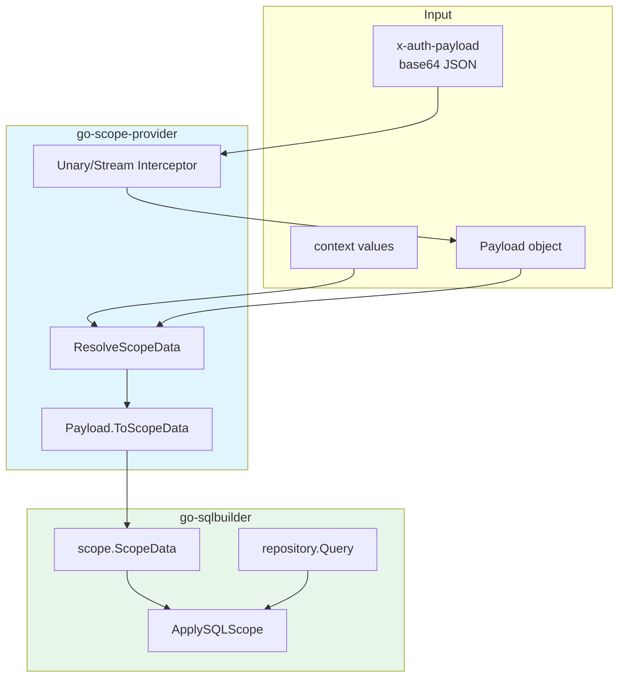
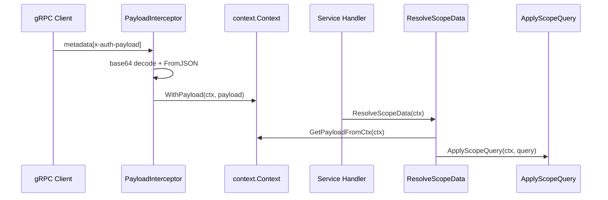

# 🚀 Go Scope Provider - 通用作用域提供者

> **认证载荷解析 | Context 注入 | SQL Scope 过滤 | gRPC Metadata 集成**

[](https://golang.org)
[](https://grpc.io)
[](https://github.com/kamalyes/go-sqlbuilder)
[](https://www.json.org)

## 📖 项目简介

Go Scope Provider 是一个**通用数据作用域解析工具包**，用于从 `context.Context` 或 gRPC metadata 中提取认证载荷，并转换为 `go-sqlbuilder/scope.ScopeData`，最终应用到 SQL 查询构建流程。

它本身不依赖业务 protobuf，也不绑定具体认证系统，适合作为多租户系统、后台管理系统、平台代理系统中的通用作用域基础库。

### 🎯 项目定位

**核心原则**: 通用、轻量、不依赖业务协议

- ✅ **通用 Payload**: 使用 JSON 结构承载 `domain`、`tenant_id`、`role_code`、`scope_bindings`
- ✅ **Context 优先**: 支持直接注入 Payload，也支持从上下文字段兜底解析
- ✅ **SQL 过滤**: 与 `go-sqlbuilder/scope` 集成，自动应用租户、地区、平台过滤
- ✅ **gRPC 集成**: 从 `x-auth-payload` metadata 解码 base64 JSON 并注入 context
- ✅ **Owner 可配置**: 支持显式 `is_owner`，也支持自定义 Owner 角色编码
- ✅ **业务无关**: 不依赖 protobuf，不关心 JWT 验签，不访问数据库

***

## 🏗️ 架构设计

### 核心链路



### 数据流



***

## 📦 安装

```bash
go get github.com/kamalyes/go-scope-provider
```

***

## 🚀 快速使用

### 1. 构造 Payload

```go
package main

import scopeprovider "github.com/kamalyes/go-scope-provider"

func NewPayload() *scopeprovider.Payload {
    return &scopeprovider.Payload{
        Domain:   1,
        TenantID: "tenant-001",
        UserID:   "user-001",
        RoleCode: "admin",
        ScopeBindings: []*scopeprovider.ScopeEntry{
            {
                ScopeType:   2,
                RegionCodes: []string{"SG", "TH"},
            },
        },
    }
}
```

### 2. 注入 context

```go
ctx := context.Background()
ctx = scopeprovider.WithPayload(ctx, payload)
```

### 3. 解析 ScopeData

```go
scopeData := scopeprovider.ResolveScopeData(ctx)
```

### 4. 应用 SQL 查询过滤

```go
query := repository.NewQuery()
query = scopeprovider.ApplyScopeQuery(ctx, query)
```

### 5. 自定义字段映射

```go
query = scopeprovider.ApplyScopeQuery(
    ctx,
    query,
    scope.WithTenantIDField("org_id"),
    scope.WithRegionCodeField("area_code"),
)
```

***

## 🔌 gRPC 集成

### 服务端拦截器

```go
package bootstrap

import (
    scopeprovider "github.com/kamalyes/go-scope-provider"
    "google.golang.org/grpc"
)

func NewGRPCServer() *grpc.Server {
    return grpc.NewServer(
        grpc.ChainUnaryInterceptor(
            scopeprovider.UnaryPayloadInterceptor(),
        ),
        grpc.ChainStreamInterceptor(
            scopeprovider.StreamPayloadInterceptor(),
        ),
    )
}
```

### Metadata 格式

| Key | Value | 说明 |
| --- | --- | --- |
| `x-auth-payload` | base64(JSON Payload) | 认证载荷 |

示例 JSON：

```json
{
  "domain": 1,
  "tenant_id": "tenant-001",
  "user_id": "user-001",
  "role_code": "owner",
  "is_owner": true,
  "scope_bindings": [
    {
      "scope_type": 2,
      "region_codes": ["SG", "TH"]
    }
  ]
}
```

***

## 🧩 核心 API

### Payload

```go
type Payload struct {
    Domain        int32
    TenantID      string
    UserID        string
    RoleCode      string
    IsOwner       bool
    ScopeBindings []*ScopeEntry
}
```

认证载荷模型，保存当前用户身份和可访问的数据范围。

### ScopeEntry

```go
type ScopeEntry struct {
    ScopeType       int32
    RegionCodes     []string
    RegionPlatforms []*RegionPlatform
    TenantIds       []string
}
```

通用作用域条目，`ScopeType` 的具体值由下游 `go-sqlbuilder/scope.Config` 决定。

### ResolveScopeData

```go
func ResolveScopeData(ctx context.Context, opts ...scope.Option) scope.ScopeData
```

解析当前上下文中的作用域数据。优先读取 `WithPayload` 注入的 Payload；如果不存在，则尝试读取：

- `ContextKeyDomain`
- `ContextKeyTenantID`
- `ContextKeyRoleCode`
- `ContextKeyIsOwner`

### ApplyScopeQuery

```go
func ApplyScopeQuery(ctx context.Context, query *repository.Query, opts ...scope.Option) *repository.Query
```

解析作用域并应用到 `repository.Query`。

### WithPayload / GetPayloadFromCtx

```go
func WithPayload(ctx context.Context, payload *Payload) context.Context
func GetPayloadFromCtx(ctx context.Context) *Payload
```

用于在中间件或业务代码中注入、读取认证载荷。

***

## 👑 Owner 判定

### 显式 Owner 标记

Payload 中的 `IsOwner` 优先级最高：

```go
payload := &scopeprovider.Payload{
    RoleCode: "tenant-admin",
    IsOwner:  true,
}

data := payload.ToScopeData()
// data.IsOwner == true
```

### 自定义 Owner 角色编码

默认 Owner 角色编码为 `owner`，可按系统约定自定义：

```go
scopeprovider.SetDefaultOwnerRoleCodes("owner", "tenant-owner", "root")
```

也可以直接传入编码集合进行判断：

```go
ok := scopeprovider.IsOwnerRoleCode("tenant-owner", "tenant-owner", "root")
```

***

## 🧪 测试

```bash
go test ./...
```

测试覆盖内容：

- Payload JSON 序列化和反序列化
- Payload 到 `scope.ScopeData` 转换
- Owner 显式标记和自定义角色编码
- context 注入和读取
- Domain 字符串、整数类型解析
- SQL Scope 查询应用
- Unary/Stream gRPC 拦截器
- metadata 缺失、base64 错误、JSON 错误容错

***

## 📁 项目结构

```text
go-scope-provider/
├── go.mod              # Go 模块定义
├── payload.go          # 通用 Payload 与 ScopeEntry 定义
├── provider.go         # context 解析与 SQL Scope 应用
├── interceptor.go      # gRPC metadata Payload 拦截器
├── provider_test.go    # Provider 与 Payload 测试
├── interceptor_test.go # gRPC 拦截器测试
└── README.md           # 项目说明文档
```

***

## 🔐 安全说明

### 信任模型

本项目只负责解析和传递作用域，不负责认证授权：

- ✅ 不验证 JWT
- ✅ 不校验接口权限
- ✅ 不访问用户、角色、权限表
- ✅ 不判断请求是否合法
- ✅ 只将可信上游注入的 Payload 转换为查询作用域

### 使用建议

1. **上游可信**: `x-auth-payload` 应由可信 Gateway 或认证服务生成
2. **显式优先**: Owner 推荐使用 `is_owner` 显式字段，不依赖角色字符串硬编码
3. **字段映射**: 不同表结构应通过 `scope.Option` 配置字段名
4. **容错策略**: metadata 无效时拦截器不会中断请求，业务侧应按需要检查 ScopeData 是否完整

***

## 🔗 相关项目

- `github.com/kamalyes/go-sqlbuilder`: SQL 查询构建和 Scope 过滤
- `github.com/HitGameAI/apex-scope-provider`: Apex protobuf 适配层
- `google.golang.org/grpc`: gRPC 服务与 metadata 传递